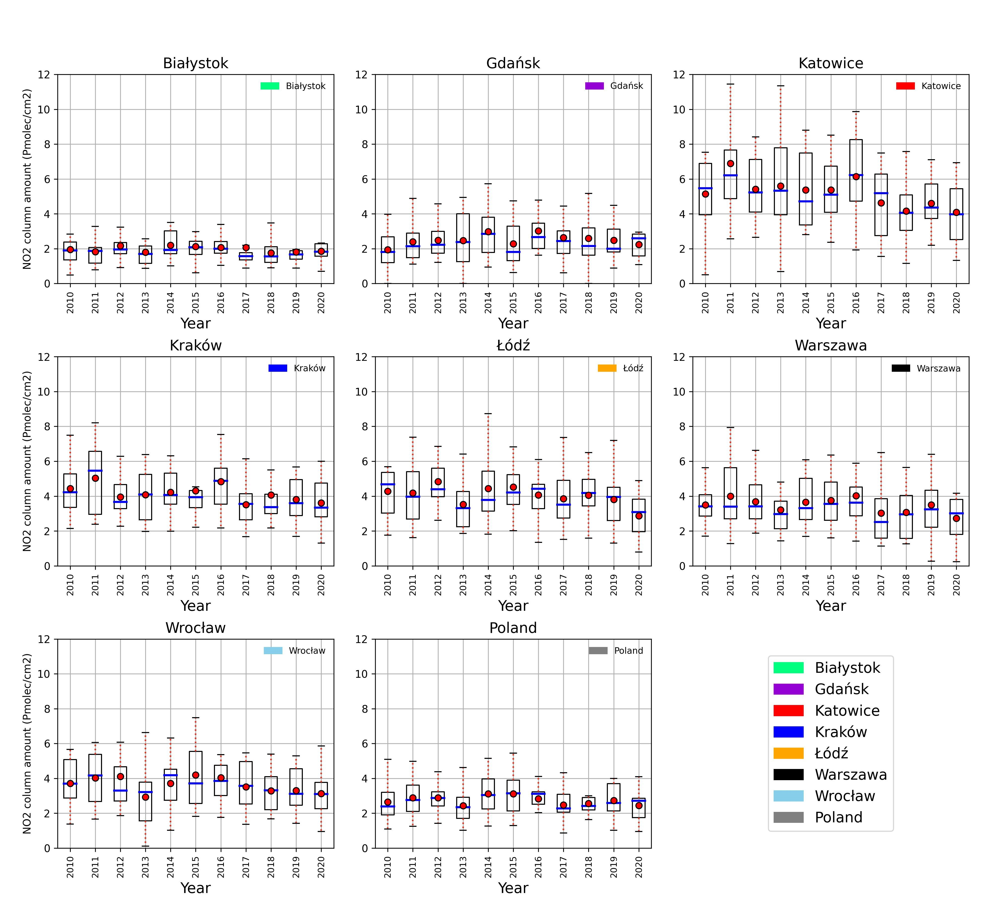
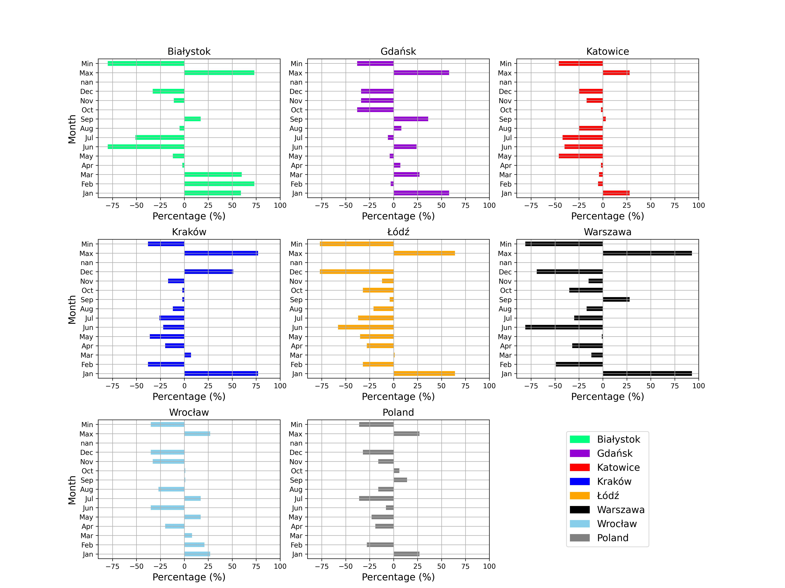
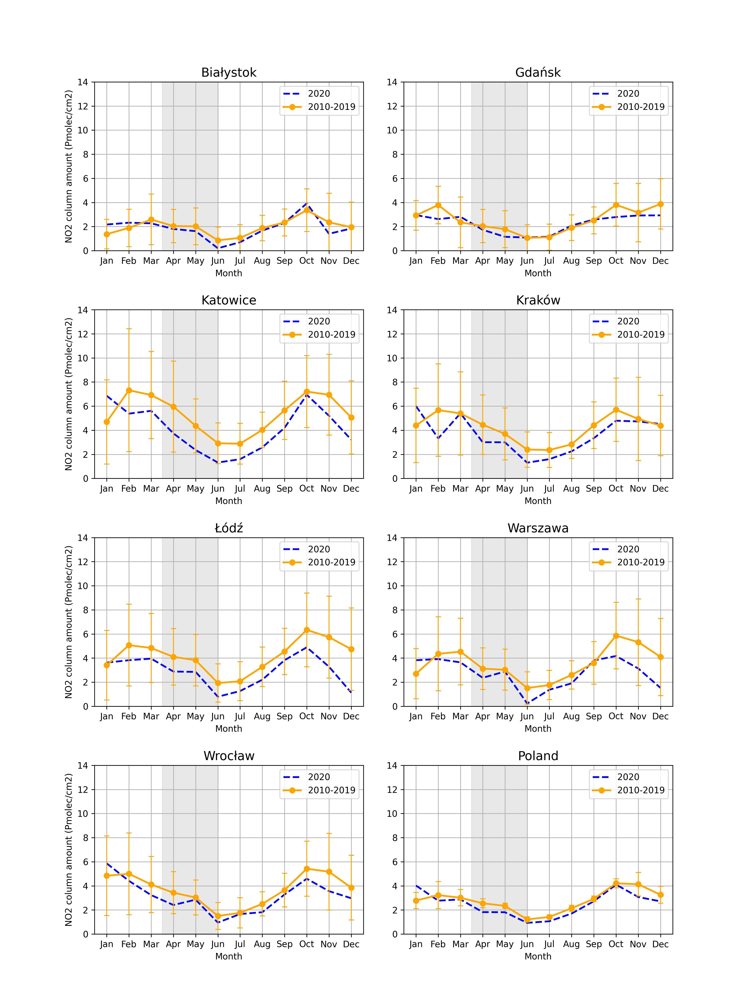

# Satellite-observations-NO2
Satellite observations showed a negligible reduction in NO2 pollution due to COVID-19 lockdown over Poland 

Authors: Emeka A. Ugboma, Iwona S. Stachlewska, Philipp Schneider and Kerstin Stebel

https://www.frontiersin.org/journals/environmental-science/articles/10.3389/fenvs.2023.1172753/full

## Introduction
Air pollution is a significant threat to both human health and the environment, causing millions of fatalities annually due to diseases such as stroke, cardiovascular conditions, and cancer. Among the major pollutants, nitrogen dioxide (NO₂) is particularly concerning due to its adverse health effects and its role as a key component of photochemical smog. NO₂ is closely linked to fossil fuel combustion and has critical implications for atmospheric chemistry and visibility. Its concentration is influenced by emission magnitudes, meteorological factors, and land surface characteristics.

Satellite remote sensing, such as data from the Copernicus Sentinel missions, provides a valuable tool for monitoring air pollution. These instruments offer synoptic views of wide areas, enabling the assessment and mapping of pollutants like NO₂ on a large scale. This capability was particularly useful during the COVID-19 pandemic, which saw temporary reductions in atmospheric emissions due to global lockdowns. Many studies documented significant NO₂ reductions across various regions, but research focusing on Poland remains limited.

This project aims to analyze the impact of the COVID-19 lockdown on NO₂ pollution over Poland using satellite observations from TROPOMI and OMI instruments. Unlike other studies, we consider the long-term variability of NO₂ using over a decade of data from OMI. Our findings reveal that the reduction in NO₂ during the lockdown was negligible, falling within typical year-to-year variability. This highlights the importance of long-term datasets for assessing the impact of transient events like the COVID-19 lockdown within a broader climatological context.

## Methodology
To evaluate the impact of the COVID-19 lockdown on nitrogen dioxide (NO₂) levels over Poland, this study utilized tropospheric NO₂ column data from TROPOMI and OMI instruments. The methodology involved:

1. Data Sources:
TROPOMI (2018–2020): High-resolution data reprocessed using the Sentinel-5P Product Algorithm Laboratory (PAL). Data were quality filtered with a qa_value > 0.75 and re-gridded to 0.01° × 0.01° resolution.

OMI (2010–2020): Long-term dataset with daily global coverage. Data were processed to remove missing points and outliers, ensuring consistent analysis.

2. Smoothing Temporal Variability:
A 14-day Simple Moving Average (SMA) was applied to TROPOMI data during the lockdown period (March–June 2020). This technique minimized the influence of daily meteorological fluctuations. 

3. Relative Change Assessment:
The Percentage Relative Change (RC) method was used to compare monthly mean NO₂ levels in 2020 with the reference period (2010–2019). 

4. Annual Variability Analysis:
Year-to-year changes in NO₂ levels were evaluated for major Polish cities to determine long-term trends. Bounding boxes were used to account for the varying satellite resolutions across cities. 

5. Meteorological Factors:
ERA5 reanalysis data (wind speed, boundary layer height, and temperature) were incorporated to account for meteorological impacts on NO₂ levels.
This multi-faceted approach allowed for a robust assessment of the lockdown's impact while accounting for both short-term variability and long-term trends.

## Results

TROPOMI Observations:
NO₂ levels decreased during the COVID-19 lockdown (March–June 2020) compared to the same period in 2019, especially in western, central, and southern Poland.
Significant reductions were observed in Gdańsk (−33.78% in March, −35.83% in April) and Katowice (−26.56% in June), while some cities (e.g., Łódź, Katowice in March) showed increases due to local variability.
The daily NO₂ data showed high variability across cities, but 14-day simple moving averages indicated only minor differences between 2019 and 2020.

OMI Long-Term Analysis:
Long-term NO₂ trends (2010–2020) revealed a declining pattern in southern and central cities like Katowice and Łódź, while cities in northern Poland (e.g., Białystok) showed little to no reduction. 
The relative change analysis confirmed that reductions during the lockdown period were within the range of typical year-to-year variability.

Meteorological Influence:
Weather conditions, including moderate wind speeds (3–8 m/s) and stable boundary layer heights, had limited impact on NO₂ levels.
Seasonal effects, such as lower solar radiation and cooler temperatures during winter and early spring, contributed to the observed variations in NO₂ concentrations.

City-Level Analysis:
Cities like Warszawa and Wrocław showed a slight reduction in NO₂ immediately after lockdown measures were implemented, but this effect was not consistent across all cities.

## Conclusions
This study analyzed the impact of the COVID-19 lockdown on NO₂ pollution in Poland using satellite data from TROPOMI (2018–2020) and OMI (2010–2020). The findings indicate that:

1. Negligible Impact of Lockdown: The reductions in NO₂ during the lockdown period were minor and within the range of typical year-to-year variability, suggesting that the lockdown's effect on air quality in Poland was negligible.

2. Long-Term Trends: A decade-long analysis revealed a consistent decline in NO₂ levels for cities in southern and central Poland, driven by long-term governmental and local emission reduction policies.

3. Value of Combined Datasets: Integrating TROPOMI’s high-resolution data with OMI’s long-term records provided a robust framework for assessing both short-term events (e.g., the lockdown) and broader trends.

4. Policy Implications: Sustained policy measures are crucial for achieving significant air quality improvements. Temporary reductions during events like lockdowns are insufficient to create lasting change.

5. Future Directions: This research highlights the need for further studies focused on specific hotspots (e.g., coal-driven power plants) and similar analyses for other Eastern European countries with limited COVID-19 air quality impacts.

In conclusion, while the COVID-19 lockdown provided temporary reductions in emissions, long-term policy-driven efforts remain the cornerstone of effective air pollution management.
